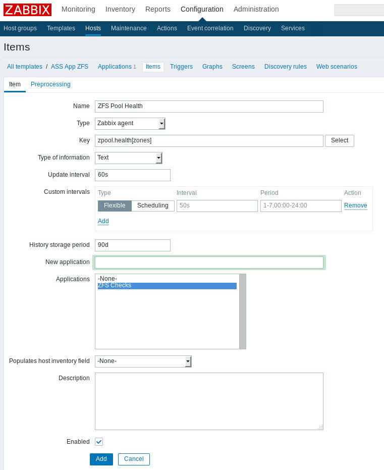
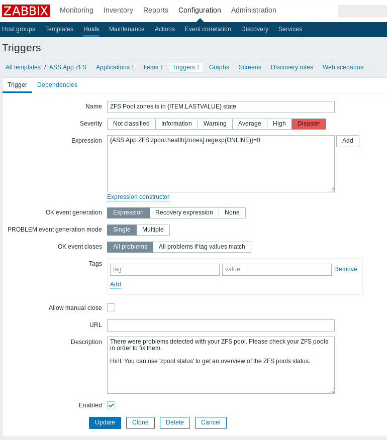
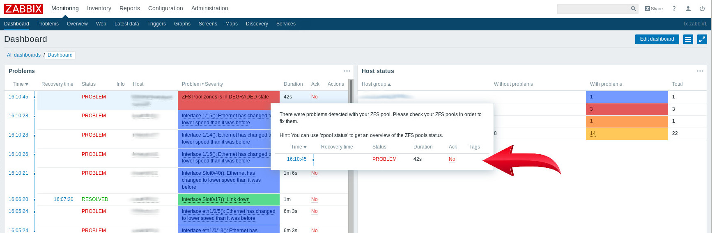
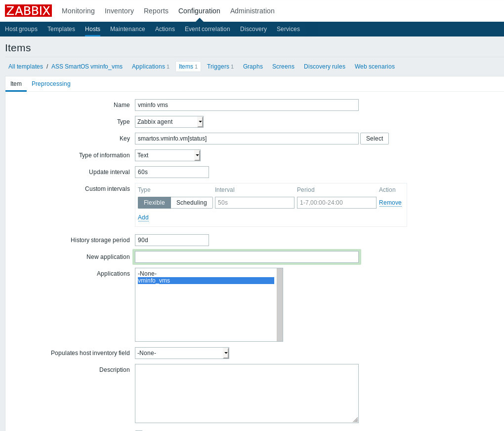
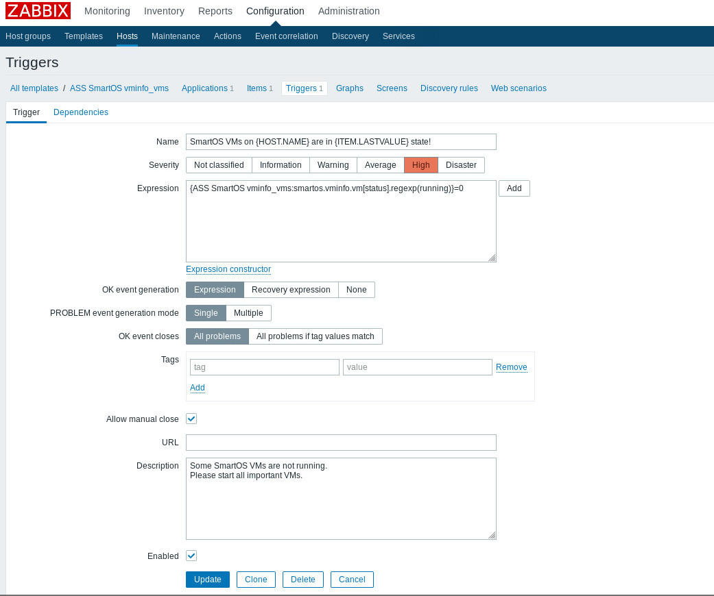
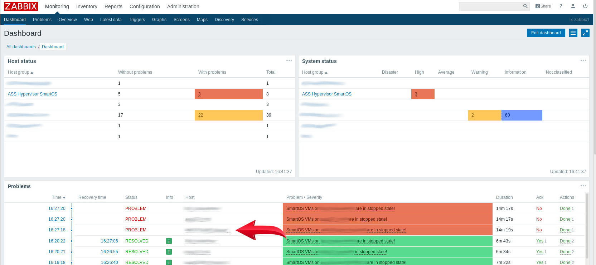

SmartOS System Admin Files
==========================

* include: SCREEN Config
* include: VIM Config
* include: smf/smartos-customizing
* include: smartos-zone-backup Script
  * https://github.com/ass-a2s/smartos-zone-backup
* include: Zabbix Agent 3.2.0
  * check: ZFS Health
  * check: VM Status

Zabbix Server Configuration - ZFS Health
========================================

Zabbix Server Configuration - VM Status
=======================================

